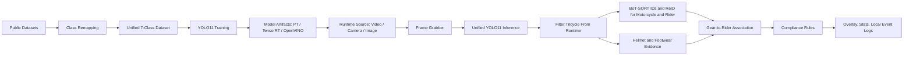
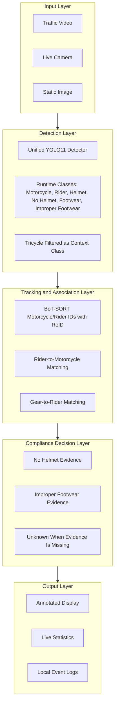
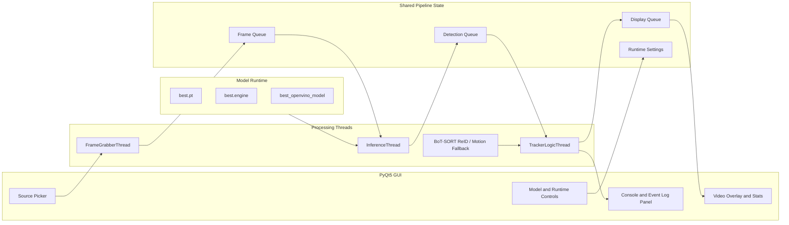
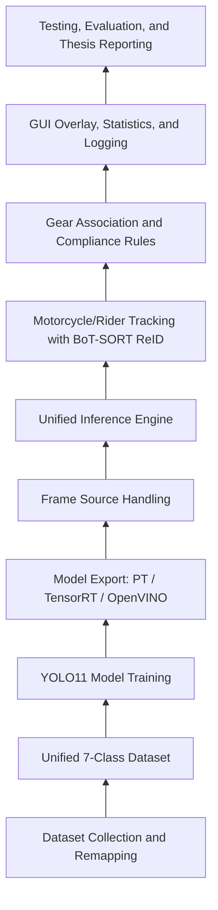

# Thesis Update Pack

Based on the current `unified` branch, the thesis should describe the system as:

- A single unified YOLO11 detector trained with a 7-class taxonomy.
- Six runtime compliance classes shown/processed by the app: motorcycle, rider, helmet, no_helmet, footwear, improper_footwear.
- `tricycle` remains a training/context class used to reduce motorcycle false positives, but it is filtered out of the runtime UI, stats, tracking, and violation logic.
- Overloading/passenger-limit detection is fully removed and should not appear as a claim, objective, result, metric, or conclusion.
- BoT-SORT is used for motorcycle/rider track IDs only. ReID appearance matching is enabled for the PyTorch `.pt` runtime through Ultralytics `model: auto`; TensorRT/OpenVINO use a motion-only BoT-SORT fallback because exported backends do not expose the same native feature hooks. Gear classes are taken from YOLO `predict()` because tracking can suppress small footwear/helmet detections.
- The app supports video files, live cameras, and static image files.
- The app can use PyTorch `.pt`, TensorRT `.engine`, or OpenVINO model artifacts depending on the available runtime.
- Local event logging records only `no_helmet` and `improper_footwear` events.

## Parts To Update

Update these thesis areas:

- Abstract: make sure it does not mention overloading and clarifies that tricycle is contextual, not a violation target.
- Chapter 1 Introduction/Rationale: remove overloading as a detected violation.
- Specific Objectives: clarify 7-class training taxonomy versus 6-class runtime compliance pipeline.
- Scope and Limitations: keep the statement that passenger limits are not monitored.
- Technical Background: describe ReID as tracking/identity support, not as detection-accuracy improvement. Note that it is enabled for `.pt` models and falls back to motion-only tracking for TensorRT/OpenVINO.
- Chapter 4 Workflow/Post-processing: replace 32-frame batch/temporal-voting wording with the current threaded pipeline, predict-plus-track design, ReID-assisted large-object tracking, conflict suppression, and positive-evidence rules.
- System Architecture: show Frame Grabber, Inference, Tracker/Compliance, GUI, and local event logger.
- Evaluation/Results/Conclusion: remove all overloading accuracy, rider-count, and passenger-limit claims.
- Figure numbering: the requested thesis figures should be Figure 1, Figure 2, Figure 8, and Figure 10. Renumber later sample detection figures if they conflict.

---

## Copy-Ready Find And Replace

### 1. List Of Figures

FIND:

```text
LIST OF FIGURES Figure 1. Conceptual Diagram Figure 2. Annotated Helmet Detection & Violation (Roboflow Dataset) Figure 3. Annotated Footwear Detection & Violation (Roboflow Dataset) Figure 4. Annotated Rider Detection (Roboflow Dataset) Figure 5. Annotated Motorcycle Detection (Roboflow Dataset) Figure 6. Unannotated CCTV Footage (CTMS Dataset) Figure 7. System Architecture Diagram Figure 8. Modified Waterfall Diagram Figure 9. Bottom-Up Development Diagram
```

REPLACE:

```text
LIST OF FIGURES Figure 1. Simplified Workflow Diagram Figure 2. Conceptual Diagram Figure 3. Annotated Helmet Detection & Violation (Roboflow Dataset) Figure 4. Annotated Footwear Detection & Violation (Roboflow Dataset) Figure 5. Annotated Rider Detection (Roboflow Dataset) Figure 6. Annotated Motorcycle Detection (Roboflow Dataset) Figure 7. Unannotated CCTV Footage (CTMS Dataset) Figure 8. System Architecture Diagram Figure 9. Modified Waterfall Diagram Figure 10. Bottom-Up Development Diagram
```

### 2. Abstract

FIND:

```text
A custom dataset was developed utilizing a multi-source assembly pipeline that merged 9 public datasets into a unified 7-class taxonomy. The system relies on a single unified YOLO11 detector trained directly end-to-end on seven classes: motorcycle, rider, helmet, no_helmet, footwear, improper_footwear, and tricycle. This unified approach lowers latency and delegates rider-gear association to track-level co-occurrence via BoT-SORT.
```

REPLACE:

```text
A custom dataset was developed using a multi-source assembly pipeline that merged 9 public datasets into a unified 7-class taxonomy. The system relies on a single unified YOLO11 detector trained end-to-end on motorcycle, rider, helmet, no_helmet, footwear, improper_footwear, and tricycle. During deployment, tricycle detections are used only as a contextual disambiguation class and are filtered out of the compliance pipeline, leaving six runtime classes for safety-gear monitoring. Rider-to-motorcycle association is handled after detection using BoT-SORT track IDs for motorcycles and riders, while helmet and footwear evidence is associated spatially with the matched rider.
```

### 3. Chapter 1 Opening Paragraph

FIND:

```text
It leverages advances in computer vision and deep learning to detect helmets, closed footwear, and overloading violations.
```

REPLACE:

```text
It leverages advances in computer vision and deep learning to detect helmet use and footwear compliance among motorcycle riders.
```

### 4. Specific Objective 1

FIND:

```text
To construct a comprehensive dataset by utilizing a multi-source dataset assembly pipeline that merges 9 public datasets and re-labels them into a unified 7-class taxonomy (motorcycle, rider, helmet, no_helmet, footwear, improper_footwear, tricycle).
```

REPLACE:

```text
To construct a comprehensive dataset by utilizing a multi-source dataset assembly pipeline that merges 9 public datasets and re-labels them into a unified 7-class taxonomy (motorcycle, rider, helmet, no_helmet, footwear, improper_footwear, tricycle), where tricycle is retained as a contextual class for reducing motorcycle false positives rather than as a compliance target.
```

### 5. Specific Objective 2

FIND:

```text
To train a single YOLO11 detector end-to-end on the unified 7-class taxonomy, utilizing BoT-SORT track-level co-occurrence to maintain stable identities for rider/gear association.
```

REPLACE:

```text
To train a single YOLO11 detector end-to-end on the unified 7-class taxonomy and deploy it in a real-time pipeline where BoT-SORT maintains stable motorcycle and rider identities, while detected helmet and footwear evidence is associated to riders through spatial overlap and containment rules.
```

### 6. Scope And Limitations Class Paragraph

FIND:

```text
The system targets seven specific classes: motorcycle, tricycle, rider, helmet, no_helmet, footwear, and improper_footwear. Tricycles are included as a class strictly to visually differentiate them from motorcycles and are explicitly excluded from the safety gear compliance evaluation.
```

REPLACE:

```text
The trained detector targets seven specific classes: motorcycle, tricycle, rider, helmet, no_helmet, footwear, and improper_footwear. In the deployed application, tricycle is retained only as a training/context class for visually differentiating 3-wheeled PUVs from motorcycles; it is filtered out of the runtime UI, statistics, tracking, and violation logging. The active compliance pipeline therefore evaluates six user-facing classes: motorcycle, rider, helmet, no_helmet, footwear, and improper_footwear.
```

### 7. BoT-SORT Technical Background

FIND:

```text
Occlusion Handling and Re-Identification (ReID) Fusion: BoT-SORT excels at fusing motion cues (Kalman Filter) with high-fidelity appearance features. In dense configurations or when a motorcycle is temporarily occluded by a larger vehicle (e.g., a jeepney), the system uses visual feature embeddings to re-acquire the correct rider ID once they reappear. This prevents bounding box flickering and ensures that gear associations remain stable over the rider's trajectory.
```

REPLACE:

```text
Occlusion Handling and Re-Identification (ReID) Fusion: BoT-SORT is used as a post-processing tracker for motorcycle and rider detections. In the implemented application, ReID is enabled for the PyTorch `.pt` runtime using Ultralytics `model: auto`, which reuses native YOLO detector features for appearance matching without requiring a separate ReID model file. This helps maintain stable motorcycle and rider IDs through short-term occlusion, camera motion, and crowded traffic. When the system runs TensorRT or OpenVINO exports, it falls back to motion-only BoT-SORT because exported backends do not expose the same native PyTorch feature hooks. Helmet and footwear classes are not tracked directly because small gear detections can be suppressed by tracker filtering; instead, they are preserved from the YOLO prediction output and associated to riders spatially.
```

### 8. Chapter 4 Conceptual Framework Paragraph

FIND:

```text
The conceptual flow of the system is divided into two phases: Dataset Unification and Inference. In the data generation phase, 9 public sources are mapped into a master taxonomy to create a robust unified split. In the inference phase, the final YOLO11 model detects instances of seven classes in a single forward pass. Association of gear-to-rider and rider-to-vehicle is performed after tracking, by checking BoT-SORT track co-occurrence within the parent vehicle's bounding box across a sliding window of frames. This robustly verifies compliance for safety gear, strictly for riders associated with a motorcycle track.
```

REPLACE:

```text
The conceptual flow of the system is divided into two phases: Dataset Unification and Runtime Inference. In the data generation phase, 9 public sources are mapped into a master taxonomy to create a robust unified split. In the inference phase, the trained YOLO11 model detects the unified taxonomy in a single detector, but the deployed pipeline filters tricycle out of the compliance workflow and processes six runtime classes. BoT-SORT is applied to motorcycle and rider detections to preserve stable IDs, using ReID appearance matching when the PyTorch `.pt` runtime is active and motion-only tracking when exported TensorRT/OpenVINO artifacts are used. Helmet, no_helmet, footwear, and improper_footwear boxes are preserved from YOLO prediction and associated to riders using overlap and containment rules. A rider is flagged only when positive no_helmet evidence is present without matching helmet evidence, or when positive improper_footwear evidence is present.
```

### 9. Chapter 4 Detection Workflow Threads

FIND:

```text
To maximize hardware utilization and achieve real-time inference speeds, the system's runtime architecture is built upon a multi-threaded pipeline utilizing batch processing. The detection workflow is divided into three asynchronous threads: 1. Camera Thread: This thread is dedicated exclusively to I/O operations. It continuously captures raw video frames from the input source and pushes them into an input buffer queue, preventing camera I/O bottlenecks from slowing down the neural network. 2. Object Detection Thread (Batch Processing): This thread pulls frames from the input queue and groups them into batches of 32 frames. A single, unified YOLO11 model processes these 32-frame batches simultaneously. Consolidating the detection of all seven target classes into one unified model optimizes memory usage and computational efficiency. 3. Object Tracking Thread: Once the detection thread outputs the bounding box coordinates and class confidence scores for the batch, this data is passed to the BoT-SORT tracking module. BoT-SORT assigns unique IDs and applies robust Re-Identification (ReID) fusion, ensuring that bounding
```

REPLACE:

```text
To maximize hardware utilization and achieve real-time inference speeds, the system's runtime architecture is built upon a multi-threaded producer-consumer pipeline. The detection workflow is divided into three asynchronous stages: 1. Frame Grabber Thread: This thread handles video files, live camera sources, and static image files. It continuously captures frames from the selected source and pushes them into a bounded frame queue, preventing source I/O from blocking neural-network inference. 2. Inference Thread: This thread loads a single unified YOLO11 detector and processes frames using PyTorch, TensorRT, or OpenVINO artifacts depending on the selected runtime. The detector is called with a low confidence floor so small gear classes can be recovered, then per-class confidence and IoU filters are applied in software. Tricycle is excluded from the deployed runtime class list so it does not enter the UI, tracker, or violation logic. 3. Tracker and Compliance Thread: This thread receives detections, suppresses mutually exclusive duplicate classes such as helmet/no_helmet and footwear/improper_footwear, assigns BoT-SORT IDs to motorcycles and riders, applies ReID appearance matching when native PyTorch detector features are available, associates gear detections to riders, renders overlays, updates statistics, and emits no_helmet or improper_footwear events for local event logging.
```

### 10. Chapter 4 Track-Level Compliance Association

FIND:

```text
1. BoT-SORT assigns track IDs to motorcycle and rider classes. 2. For each motorcycle track, the system accumulates the set of rider track IDs whose box centroids lie within the vehicle bounding box for a minimum of N consecutive frames. 3. For each confirmed rider track, a violation is flagged if the no_helmet class co-occurs more frequently than the helmet class over the lifetime of the rider's track. This temporal voting system is similarly applied to the footwear classes.
```

REPLACE:

```text
1. YOLO detections are first filtered by class-specific confidence thresholds, and mutually exclusive class pairs are cleaned by suppressing the lower-confidence overlapping box. 2. BoT-SORT assigns track IDs only to motorcycle and rider classes, preserving stable IDs for the large objects that need identity continuity; ReID appearance matching is used when the active PyTorch `.pt` model exposes native detector features. 3. Riders are associated to motorcycles using intersection-over-area between rider and motorcycle boxes. 4. Helmet, no_helmet, footwear, and improper_footwear boxes are associated to the best matching rider using overlap, with a center-point containment fallback for small gear boxes. 5. A helmet violation is emitted only when a confident no_helmet detection is attached to a rider and no helmet detection is attached to the same rider. Missing helmet evidence alone is treated as unknown, not non-compliant. 6. A footwear violation is emitted when improper_footwear is attached to a rider. Missing footwear evidence alone is treated as unknown, not non-compliant.
```

### 11. YOLO11 Training Parameters Class Row

FIND:

```text
Number of Classes (nc) 7 Motorcycle, Rider, Helmet, No_Helmet, Footwear, Improper_Footwear, Tricycle.
```

REPLACE:

```text
Number of Classes (nc) 7 Motorcycle, Rider, Helmet, No_Helmet, Footwear, Improper_Footwear, Tricycle. Tricycle is evaluated as a context/disambiguation class and filtered out of runtime compliance reporting.
```

### 12. System Analysis And Design

FIND:

```text
The proposed system utilizes a highly optimized, unified YOLO11 object detection model to identify the seven target classes simultaneously. To maximize throughput, the input stream is managed via a three-stage multithreaded pipeline (Camera, Detection, Tracking) utilizing 32-frame batch processing. Detection thresholds are configurable (defaulting to 0.25). Once the unified model processes a batch, BoT-SORT assigns unique IDs. The core logic then splits into two track-level voting checks for every tracked rider associated with a validated motorcycle: 1. Helmet Vote : Does the no_helmet track-level vote outweigh the helmet vote over the rider's trajectory? 2. Footwear Vote: Does the improper_footwear track-level vote outweigh the footwear vote?
```

REPLACE:

```text
The proposed system utilizes a highly optimized unified YOLO11 object detection model trained on the seven-class taxonomy. During deployment, the runtime pipeline filters tricycle out of the compliance workflow and evaluates six user-facing classes. The input stream is managed through a three-stage multithreaded pipeline consisting of frame grabbing, inference, and tracker/compliance logic. Detection thresholds are configurable globally and per class. The inference stage preserves small gear detections from YOLO prediction, while BoT-SORT supplies stable track IDs only for motorcycles and riders, with ReID appearance matching available in the PyTorch `.pt` runtime. The compliance logic then performs two rule checks for each rider associated with a validated motorcycle: 1. Helmet Evidence: Is there confident no_helmet evidence attached to the rider without corresponding helmet evidence? 2. Footwear Evidence: Is there improper_footwear evidence attached to the rider?
```

### 13. Target Performance Thresholds

FIND:

```text
Detection: mAP@50  90% and mAP@50-95  60% across all seven unified classes ('motorcycle', 'tricycle', 'rider', 'helmet', 'no_helmet', 'footwear', 'improper_footwear').
```

REPLACE:

```text
Detection: mAP@50 and mAP@50-95 are evaluated across the seven trained classes ('motorcycle', 'tricycle', 'rider', 'helmet', 'no_helmet', 'footwear', 'improper_footwear'), while deployed compliance reporting focuses on the six runtime classes used by the application ('motorcycle', 'rider', 'helmet', 'no_helmet', 'footwear', 'improper_footwear').
```

### 14. Chapter 5 Dataset Construction Paragraph

FIND:

```text
Because the unified model was trained to learn class identity and violations directly (e.g., explicitly recognizing no_helmet and tricycle), fragile per-frame spatial logic was no longer required at inference. This validated dataset served as the foundation for training the unified YOLO11 model.
```

REPLACE:

```text
Because the unified model was trained to learn class identity directly, including no_helmet and tricycle, the deployed system no longer required separate class-specific detector cascades. Spatial association is still used at inference to connect detected gear to the correct rider and rider to the correct motorcycle. This validated dataset served as the foundation for training the unified YOLO11 model.
```

### 15. Chapter 5 Sample Detection Outputs Intro

FIND:

```text
The qualitative evaluation focuses on the model's ability to identify the seven target classes and support track-level compliance association under dense traffic conditions.
```

REPLACE:

```text
The qualitative evaluation focuses on the model's ability to identify the six runtime compliance classes, while recognizing that tricycle remains a trained context class filtered out of compliance reporting.
```

### 16. Chapter 5 Sample Figure Captions

FIND:

```text
Figure 10. Sample detection output demonstrating accurate localization of 'motorcycle', 'rider', 'helmet', and 'footwear' on a compliant subject.
```

REPLACE:

```text
Figure 11. Sample detection output demonstrating accurate localization of 'motorcycle', 'rider', 'helmet', and 'footwear' on a compliant subject.
```

FIND:

```text
Figure 11. Sample detection output illustrating a safety violation, successfully identifying 'improper_footwear' and 'no_helmet' (if applicable) within the rider's bounding box.
```

REPLACE:

```text
Figure 12. Sample detection output illustrating a safety violation, successfully identifying 'improper_footwear' and 'no_helmet' when positive evidence is visible within the rider's bounding box.
```

### 17. Conclusion Opening

FIND:

```text
By integrating the YOLO11 object detection model with the BoT-SORT tracking algorithm, the researchers successfully automated the detection of helmet use, footwear compliance, and overloading.
```

REPLACE:

```text
By integrating the YOLO11 object detection model with the BoT-SORT tracking algorithm, the researchers successfully automated the detection of helmet use and footwear compliance among motorcycle riders.
```

### 18. Conclusion Tracking Paragraph

FIND:

```text
4. Effective Tracking in Adverse Conditions: The integration of BoT-SORT provided robust Re-Identification (ReID) and short-term occlusion handling. By matching appearance embeddings across frames, the system maintained stable track IDs through brief occlusions caused by overlapping vehicles in dense traffic, ensuring accurate rider counts for overloading violations.
```

REPLACE:

```text
4. Effective Tracking and Association in Dense Traffic: The integration of BoT-SORT provided stable motorcycle and rider track IDs through short-term occlusion and camera motion. When running the PyTorch `.pt` model, ReID appearance matching further supports identity persistence by comparing native detector features across frames. This allowed the system to associate riders with motorcycles more consistently and attach detected helmet or footwear evidence to the correct rider for compliance evaluation.
```

---

## Figure 1. Simplified Workflow Diagram



Caption:

```text
Figure 1. Simplified workflow diagram of the proposed safety-gear compliance system, from dataset unification and YOLO11 training to runtime inference, tracking, compliance evaluation, and event output.
```

## Figure 2. Conceptual Diagram



Caption:

```text
Figure 2. Conceptual diagram showing how traffic input is transformed into object detections, tracking associations, compliance decisions, and user-facing outputs.
```

## Figure 8. System Architecture Diagram



Caption:

```text
Figure 8. System architecture diagram of the deployed application, showing the PyQt5 interface, shared pipeline state, asynchronous processing threads, model runtime artifacts, and BoT-SORT ReID/motion fallback tracking.
```

## Figure 10. Bottom-Up Development Diagram



Caption:

```text
Figure 10. Bottom-up development diagram showing how the system was built from dataset construction and model training toward runtime integration, compliance logic, user interface output, and final evaluation.
```
